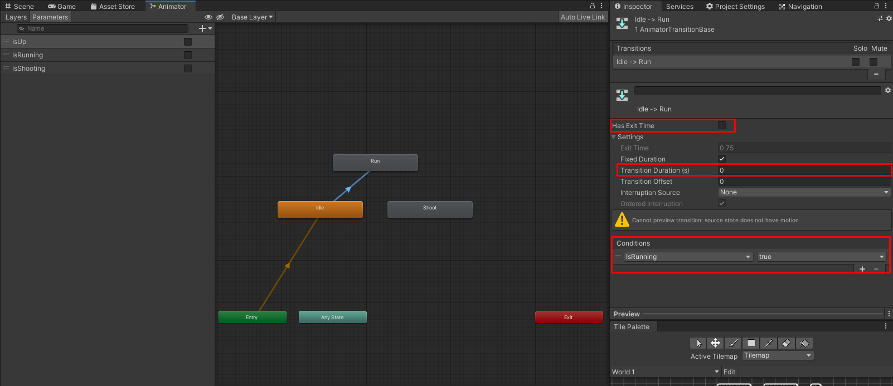
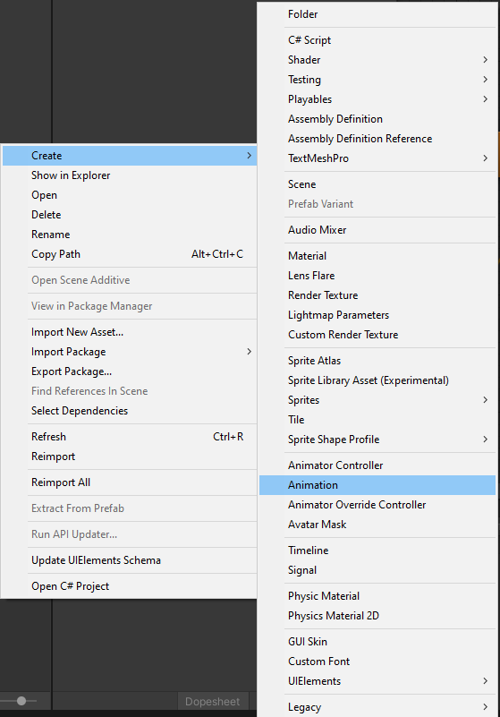
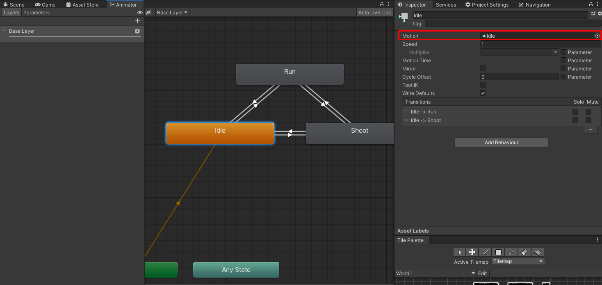
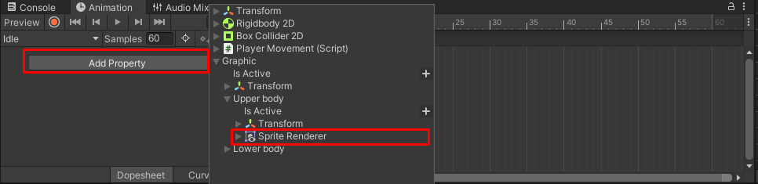
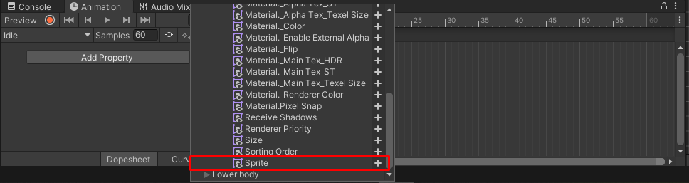

# Game-Dev-TC-modul-4
Modul 4 Komunitas Game Dev TC 2020

## Tujuan
1. Peserta dapat menggunakan Tile Map
2. Peserta dapat membuat Animasi

## Tile Map
```Tile map``` adalah komponen yang digunakan untuk menghandle ```Tile Assets``` untuk membuat 2D Levels. Jadi ```Tilemap``` ini akan menyimpan informasi dari objek bertipe ```Tile Assets``` yang nanti akan ditujukan ke komponen ```Tile Renderer``` dan ```Tile Collider```. Dengan ```Tile Map``` kita dapat menyusun level dengan cepat dan mudah.

Jadi secara simple :
- ```Tile Map``` adalah komponen yang menyimpan data-data ```Tile Assets``` yang akan berada di scene.
- ```Tile Renderer``` adalah komponen yang mengambil data dari ```Tile Map``` dan bertugas untuk menggambarkannya ke scene sesuai dengan informasi di ```Tile Asset``` yang disimpan ```Tile Map```.
- ```Tile Collider``` adalah komponen yang digunakan untuk memasang collider2D menurut informasi yang ada di ```Tile Map```. ```Tile Collider``` akan membuat collider sesuai dengan ```Tile Asset``` yang diberikan oleh ```Tile Map```.

### Cara Membuat Tile Asset

1. Buatlah Folder dengan nama "Tile Assets". Folder ini akan digunakan untuk menyimpan Tile Assets kita.


2. Masuk ke dalam folder "Tile Assets". Klik kanan dan pilih create lalu pilih Tile.


3. Beri nama, lalu klik save.


4. Dengan ini akan terbuat asset ```Tile Asset``` yang dengan nama yang kita buat. Jika kita click Tile, maka dalam inspector kita akan melihat data-data dapat kita berikan ke ```Tile Asset``` ini. Disini, kita bisa memasukkan sprite, tipe collider kita, dan warna tint.


Ini adalah salah satu cara membuat Tile Asset. Namun, jika kita melakukan ini untuk setiap sprite maka akan sangat lama dan tidak efektif. Selanjutnya, adalah bagaimana cara kita langsung membuat Tile Asset dengan cepat.

### Cara Cepat Membuat Tile Asset

1. Pertama, buka Tile Pallete window dengan ke Window > 2D > Tile Pallete.


2. Akan terbuka Tile Pallete. Kalian bisa dock window tersebut dengan tekan window tersebut dan arahkan ke suatu tempat.
3. Klik Create New Pallete, Lalu masukkan namanya. Untuk ini akan saya pilih "World 1". Klik create lalu pilih folder Tile Assets.


Pallete disini akan mirip seperti color pallete. Dengan ini kita bisa mengelompokkan Tile Asset sesuai dengan penggunaannya. Misalkan ada Tile Pallete untuk Sky, untuk Ground, untuk Building. Dengan ini jika kita ingin membuat level di sky dapat memilih Tile yang pas tanpa terpenuhi oleh Tile yang tidak berhubungan.

5. Buka folder Sprites. Select semua sprites, lalu drag and drop ke Tile Pallete. Sebelum pilih save, arahkan ke folder Tile Assets. Dengan ini akan terbuat Tile Asset dengan nama sprite dan attribut spritenya sudah sesuai dengan sprite yang di drag tersebut.

6. Akan diminta tempat penyimpanan. Navigasikan ke folder Tile Assets. Lalu pilih save.


### Cara Membuat Tilemap

1. Untuk membuat tile map, klik kanan di hierarchy 2D Objects > Tilemap.


2. Dengan ini akan terbuat 2 Game Objects. Yang pertama bernama Grid dan yang kedua bernama Tilemap. Grid menjadi parent Tile Map. Grid akan berisi komponen grid yang  mendefinisikan bagaimana besar setiap tile. Sedangkan Tilemap akan berisi komponen bernama Tilemap yang akan menyimpan informasi tile yang akan kita render.

3. Untuk menggambar Tile, select game object Tilemap. Maka attribut Active Tilemap akan berubah di Tile Pallete. Pilih satu tile dan pilih tool brush. Arahkan ke scene dan mulai menggambar level yang kalian mau.


4. Untuk memudahkan penggambaran, object square akan dinon-aktifkan terlebih dahulu.
5. Buat level sesuai dengan imajinasi kalian.
Untuk game ini, levelnya akan sebagai berikut.


6. Selanjutnya kita tambahkan komponen ```Tile Collider``` pada object Tile Map. Secara otomatis, akan ada kotak hijau yang menandakan terdapat collider di peta tersebut.
7. Jangan lupa setting layer Tilemap menjadi Ground.

Kita dapat mencoba memainkan gamenya.

Untuk membuat tilemap dengan cell size yang sama, kita dapat langsung membuat empty game object yang menjadi child Grid. Lalu menambahkan komponen ```Tilemap``` dan ```Tilemap Renderer```. Jika membutuhkan collision bisa menambahkan ```Tilemap Collider```.

## Fixing Rigidbody Rotation, Tilemap Collider and Physics Material
Setelah kita memainkan gamenya, ada 2 masalah yang muncul. Pertama player dapat berotasi jika menabrak sesuatu, dan yang kedua pemain akan menempel ke tembok jika kita gerakkan ke arah tembok. Mari kita perbaiki bug ini.


Dan yang terakhir jika kita mencoba memainkan gamenya, beberapa kali pemain akan tersandung. Ini karena meskipun secara teori tidak ada gap antara tile satu dengan lainnya, terkadang collider pemain masih menganggap player dan tile collide.

### Rigidbody Constraint
Seperti yang kita tahu, ```Rigidbody``` akan mengoverride attribut di transform seperti posisi, rotasi. Dalam ```rigidbody```, kita dapat membuat constraint agar ```rigidbody``` tidak mengubah suatu property dalam transform. Untuk ```Rigidbody2D``` dapat di setting di gambar berikut. Dapat dilihat kita dapat memberikan 3 constraint, yaitu Freeze Position X, Freeze Position Y, dan Freeze Rotation Z.  Sesuai dengan namanya, freeze position X berarti ```Rigidbody``` tidak akan mengubah posisi x object tersebut, kita tetap bisa mengubah valuenya jika mengubah transform akan tetapi ```Rigidbody``` tidak akan mengubah value tersebut sama sekali. Begitu juga berlaku untuk Freeze Position Y. Yang terakhir Freeze Rotation Z berarti Rigidbody tidak akan mengubah rotasi dari transform tersebut akan tetapi kita tetap bisa mengubah rotasi transform menggunakan komponen transform.


### Physics Material
Dalam Collider kita dapat memberikan ```Physics Material```. Secara default, ```Physics Material``` akan diberi friction dan tidak ada bounciness. ```Physics Material``` digunakan untuk mengontrol bagaimana cara ```Rigidbody``` menkalkulasikan kecepatan saat ada collision antara 2 objek.

### Membuat Physics Material
Sebelum membuat Physics Material akan lebih baik membuat folder yang berisi semua Physics Material untuk mengelompokkan dan organizational purposes. Untuk kali ini foldernya akan bernama "Physics Material".

Masuklah ke dalam folder tersebut, lalu klik kanan > Create > Physics Material 2D. Beri nama "Slippery". Setelah itu setting, frictionnya diubah menjadi 0.
Dalam inspector, kita dapat mengubah friction dan bounciness. Friction akan menentukan bagaimana ```Rigidbody``` mengkalkulasikan bagaimana collision antar 2 benda yang bergesekan mengurangi kecepatan. Bounciness akan menentukan bagaimana Rigidbody mengkalkulasikan bagaimana collision antar 2 benda yang berbenturan mengaffect kecepatan. Jika bounciness berisi satu maka, objek yang bertabrakan akan mempunyai kecepatan yang sama namun berlawanan arah.


Setelah membuat physics material. Klik object tilemap, lalu masukkan physics material ke dalam kolom physics material di Collider.


### Composite Collider
```Composite Collider``` merupakan ```collider``` khusus yang digunakan untuk menggabungkan semua collider "dibawahnya" dengan attribut used by composite active. Apa maksud dibawahnya? Artinya semua komponen ```collider``` yang ada di satu game object dengan ```Composite Collider``` dan semua komponen ```collider``` yang berada di child game object komponen ```composite collider```. 

Dengan menambahkan ```Composite Collider``` ke object Tilemap dan mengaktifkan Used by composite di ```Tilemap Collider``` maka kita akan meanggabungkan semua ```collider```.

```Composite Collider``` juga menambahkan ```Rigidbody``` ke dalam game object tersebut. Jadi jika objectnya static jangan lupa mengubah body type menjadi static.


NOTE : Jangan lupa memberi physics material slippery

## Animation
Animasi merupakan hal yang penting dalam game. Animasi dalam game unity dihandle menggunakan Finite State Machine. Dimana kita akan mendefinisikan beberapa state, lalu kita dapat memberikan transisi antar state sesuai dengan variable yang kita buat di Animator tersebut. Script akan mengakses value variable di animator ini. Setiap state akan berisi informasi keyframe.

Sebelum belajar animation, kita buka window Animation dan window Animator.


### Animator
```Animator``` merupakan komponen yang digunakan untuk mengkontrol state animasi dari variable parameter - parameter. Dalam komponen ```Animator``` kita akan memberi asset bernama ```Animation Controller```. ```Animation Controller``` merupakan asset yang bertugas memberi tahu bagaimana komponen mengkontrol state animasinya.


Untuk membuat suatu animasi, pertama kita harus menambahkan komponen ```Animator``` ke game object yang mau kita animasikan. Dalam project ini kita akan menambahkannya ke object Player.


Dapat dilihat ada beberapa attribute dalam komponen tersebut. Untuk saat ini yang kita mau fokuskan adalah attribut ```Controller```. Selanjutnya kita buat ```Animation Controller``` asset. Sebelum itu kita buat folder bernama "Animation" untuk menyimpan semua asset mengenai animasi. Dalam folder "Animation" buatlah folder "Player" agar semua asset animasi player dapat kita taruh dalam folder "Player".

Masuklah ke folder "Player" dan klik kanan lalu pilih Create > Animation Controller.


Beri nama "Player" lalu tekan enter. Drag and drop asset tersebut ke attribute Controller di komponen ```Animator```.


Dengan ini kita bisa melihat Window Animator akan mempunyai tampilan seperti berikut saat kita menselect game object dengan komponen ```Animator```.


Berikut adalah scheme sprite sheet.


Dapat dilihat dari skema animasi tersebut, akan dibutuhkan 6 state.

Untuk membuat state kita dapat klik kanan di area state yang ada di window Animator lalu pilih Create-State > Empty. Tekan state yang sudah dibuat lalu beri nama menggunakan inspector. Untuk sementara kita akan memberikan state saat player tidak menghadap ke atas. Buatlah 3 state sesuai dengan nama berikut.


Dapat dilihat, akan ada minimal satu state yang tersambung dengan state Entry. State yang tersambung dengan state entry adalah state yang pertama kali dimasuki oleh ```Animator Controller```.

Selanjutnya kita buat variable untuk parameter Animator. Untuk membuat parameter, klik simbol tambah di sisi atas kanan panel kiri. Disini kita dapat membuat beberapa jenis variable. Untuk ini, kita ingin variabel bool untuk IsRunning dan IsShooting. Buatlah 2 variabel tersebut. 

Setelah itu buat transisi antar state Idle ke run dengan klik kanan di state Idle, lalu pilih Make Transition selanjutnya klik ke Run. Dengan ini akan ada transisi. Jika garis panah yang menghubungkan kedua state, kita bisa mengubah beberapa atribute.



Disini, yang mau kita ubah adalah Has Exit Time, Transition Duration, dan Conditions. Has Exit Time berarti animasi akan berganti setelah kondisi terpenuhi dan mencapai exit time tertentu. Ini kita uncheck agar animasi langsung berubah setelah kondisinya tercapai. Transition duration adalah durasi sebelum animasi melakukan transisi ke animasi selanjutnya. Pada 3D animation ini akan memberikan inbetween frame. Sayangnya pada animation frame based tidak akan merubah apapun dan hanya memberikan delay sebelum animasi berubah. Maka kita beri 0 juga. Yang terakhir merupakan Kondisi, dimana kita dapat memberikan kondisi kapan transisi ini akan aktif. Jika kita memberikan lebih dari satu kondisi maka untuk transisi aktif semua kondisi tersebut harus benar.

Note : Untuk state A dan B kita bisa memberikan lebih dari satu transisi. Jadi pada transisi 1 dan yang lainnya akan berfungsi sebagai OR.

Buatlah transisi dengan kondisi seperti berikut dan settingan has exit dan transision duration sama.

1. Idle -> Run : IsRunning == True, IsShooting == False
2. Idle -> Shoot : IsShooting == True
3. Run -> Idle : IsRunning == False, IsShooting == False
4. Run -> Shoot : IsShooting == True
5. Shoot -> Run : IsShooting == False, IsRunning == True
6. Shoot -> Idle : IsShotting == False, IsRunning == False

Dengan ini animasi akan berubah sesuai dengan bagaimana kondisi 2 variabel tersebut.

Akan tetapi untuk saat ini, kita masi belum memasukkan animasi ke dalam state - state tersebut. Selanjutnya kita akan belajar cara membuat ```Animation``` asset.

### Animation
```Animation``` asset akan menyimpan keyframe dan animasi. Dimana ```Animation``` asset ini akan diassign ke setiap state di ```Animation Controller```. Berikut adalah cara membuat animation asset.

#### Membuat Animation Asset
 Untuk membuat ```Animation``` asset kita harus navigasi ke folder tempat kita mau menyimpan asset tersebut. Untuk project ini akan disimpan di "/Animation/Player/".

1. Pertama klik kanan di project window, lalu pilih Create > Animation.



2. Beri nama "Idle" lalu tekan enter
3. Buat 2 animasi lagi, dengan nama "Run" dan "Shoot".
4. Setelah itu ke Animator Controller dan pilih setiap state lalu pada attribut motion, masukkan animation yang sesuai.



5. Selanjutnya dapat klik Game Object Player di Hierarchy. Sekarang pada animation window kita dapat menambahkan property yang mau dianimasikan. Untuk ini kita ingin menambahkan pergantian sprite pada Upper Body. Maka kita akan milih attribut Sprite di Sprite Renderer pada Upper Body.





6. Selanjutnya kita dapat menambahkan sprite dalam time line dan mengatur frame rate animasi. Untuk mengatur frame rate animasi dapat mengubah Samples nya. Untuk mencoba animasinya dapat menekan tombol play di window animation. Preview animation dapat dilihat di scene view.


Untuk animasi idle saya akan beri frame rate 8. Lakukan hal tersebut untuk animasi lainnya.

7. Setelah membuat semua animasi, kita dapat memberikan looping terhadap animasi yang kita buat tadi. Dengan memilih salah satu animasi dan mencheck Loop Time di inspector.

Selanjutnya kita akan mengontrol 2 variabel tadi melalui Script. Untuk kali ini, kita akan memasukkan kodenya ke ```PlayerMovement.cs```. Nanti kita akan belajar bagaimana cara berkomunikasi antara script dan PBO yang benar. Untuk sementara kita akan memasukkan kodenya ke ```PlayerMovement.cs```.

``` cs
using System.Collections;
using System.Collections.Generic;
using UnityEngine;

public class PlayerMovement : MonoBehaviour {

	private Rigidbody2D rb2d;
	private Animator anm;

	private float dir;
	[SerializeField] private float speed = 5;
	[SerializeField] private float jumpForce = 10;
	[SerializeField] private LayerMask groundMask;
	[SerializeField] private float groundRayDist = 1f;
	private bool isTouchingGround = false;
	private bool isShooting = false;

	void Start() {
		rb2d = GetComponent<Rigidbody2D>();
		anm = GetComponent<Animator>();
	}

	void Update() {
		float horizontalInput = Input.GetAxis("Horizontal");
		dir = horizontalInput;
		if (Input.GetButtonDown("Jump") && isTouchingGround) {
			Jump();
		}
		isShooting = Input.GetButton("Fire1");
		anm.SetBool("IsShooting", isShooting);
	}

	private void FixedUpdate() {
		rb2d.velocity = new Vector2(dir * speed, rb2d.velocity.y);
		isTouchingGround = Physics2D.Raycast(transform.position, Vector2.down, groundRayDist, groundMask);
		anm.SetBool("IsRunning", isTouchingGround && (Mathf.Abs(rb2d.velocity.x) > 0.2f));
	}

	private void OnDrawGizmosSelected() {
		Gizmos.color = Color.green;
		Gizmos.DrawLine(transform.position, transform.position + Vector3.down * groundRayDist);
	}

	private void Jump() {
		rb2d.velocity = new Vector2(rb2d.velocity.x, jumpForce);
	}

}
```

Sekarang dapat kita play, dan semua teranimasikan kecuali kaki player.

## Reference
https://docs.unity3d.com/Manual/class-Tilemap.html
